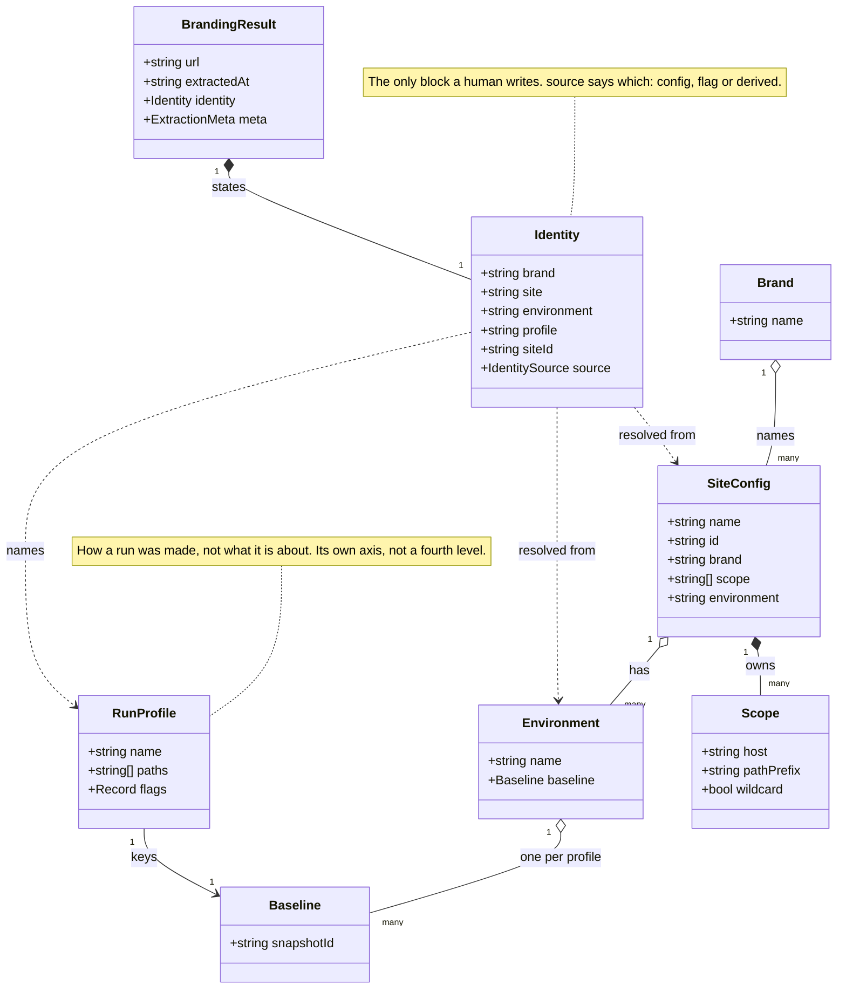
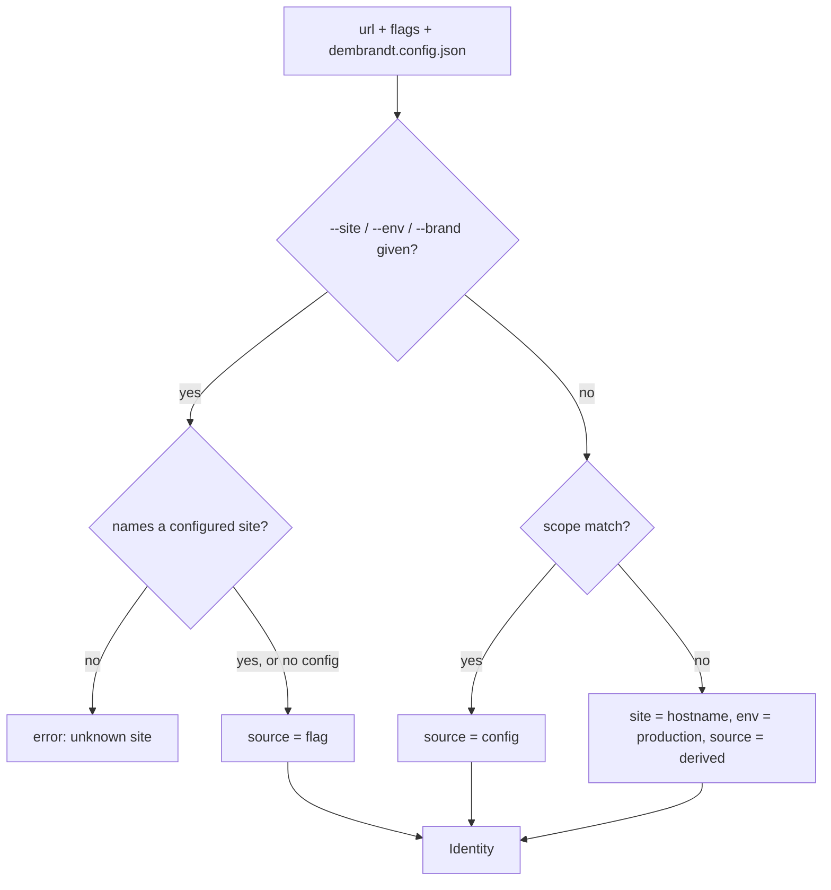

# Extraction identity: brand, site, environment

Status: proposal. Implemented in `lib/identity.ts`; not yet stamped on output.

Today everything is keyed by hostname. An extraction belongs to a domain, a domain
is a brand, and the portfolio is the list of domains. That one level cannot say
that staging and production are the same brand at two stages, that `docs.` and
`app.` may be one design system or three, or that `dembrandt.com` and
`dembrandt.com/app` are two surfaces of one host.

Identity belongs in the extraction, not in the App. The extraction is what every
consumer reads: CLI, App, MCP server, CI gate, a customer's own pipeline. If the
App invents identity, every other consumer keeps guessing from the hostname, and
two consumers guess differently.

## Type model



Three levels, not four. A section such as `/app` is not a new level: if it has its
own baseline and can drift on its own it is a site, and if it shares one it is a
`scope` entry. Either answer is already expressible, so a fourth level would earn
nothing.

`scope` is a list, not a single host, which is what lets one site span
`app.acme.com` and `acme.com/app`, and what lets `docs.acme.com` be its own site.
A leading `*.` covers every subdomain for the case where one design system spans
all of them; a named subdomain elsewhere still wins over the wildcard.

## Resolution



Flags beat config so an ad hoc run can override a repo's committed identity.
Config beats derivation. Derivation is the floor and reproduces today's hostname
key exactly, so existing data does not become wrong, it becomes labelled.

A `--site` naming no configured site is an error, not a new site. A typo would
otherwise silently start an empty baseline history and report zero drift, and the
mistake would surface weeks later.

`siteId` is stable and opaque; `name` is a mutable label. Storage keys by the id,
because the App's blob layout puts the key in the path
(`extractions/{userId}/{key}/...`) and renaming a site must not move blobs or
break its drift history.

## Profiles: the same site measured two ways

A site is often measured in more than one way. Tone of voice wants the homepage
with `--voice`; design linting wants `--crawl 5`. Both are the same site, so they
are not two sites, but they are not comparable to each other either, so they
cannot share a baseline.

So an extraction has three axes, not one: what it is about (identity), how it was
made (profile), and when (`extractedAt`, keyed by `meta.snapshotId`). A baseline
belongs to `(siteId, environment, profile)`.

```
site   marketing
  env  production
    profile  design   --crawl 5      -> baseline, drift score
    profile  voice    / --voice      -> its own baseline, its own timeline
```

A portfolio row stays `(site, env)` and carries N profiles. Their scores are not
averaged into one number: design drift and a voice change are different claims,
and a combined figure would be an artefact of which profiles happened to run.

The profile is named in config rather than fingerprinted from the flags. A hash
needs no human but puts "baseline a3f9" in the portfolio, and nobody can tell
which run that was. The declared flags are then the check: a run whose flags do
not match its profile is warned about, the same false-drift problem `drift.ts`
already reports for `--dark-mode` and `--mobile` mismatches.

A profile also carries its target paths, since that is what separates the two
runs above as much as the flags do.

## Placement in the output

`identity` is a top-level block beside `url`, not part of `meta`. `meta` holds the
run's conditions: versions, viewport, flags, degraded. All of it measured or set
by the environment. Identity is a stated fact and has to be marked as one, which
is also what DEM-320 asks for.

A crawl stays one extraction with one identity. Multi-page runs already merge into
one result with `pages[]`, and `scope` is where the paths belonging to a site are
declared.

## Terminology: portfolio is a view, not a level

Brand, site, environment and profile form the measurement axis, and each passes
the same test: it has its own baseline and can drift on its own.

A portfolio is the collection of brands an account manages. It fails that test,
because it is not a subject of measurement at all. It belongs to a second axis,
ownership, which runs account > (client) > brand and answers who may see a thing
and who pays for it. With one portfolio per account it needs no entity: the
account already exists as the root of the blob layout, and the portfolio is how
the App renders it. Several named portfolios under one account would be a saved
filter, not a new level.

For an agency whose client owns several brands, the entity worth having is the
client, not the portfolio. It is still on the ownership axis.

This answers the third decision directly. Grouping by brand and grouping by
ownership are not alternatives: they are two axes, so the portfolio groups by
ownership and shows brands within it, and a flat list stays a third view of the
same data.

Ownership therefore stays out of the extraction. Identity is in the output
because every consumer needs it to group; ownership is needed by none of them and
lives account-side. The concrete reason is that `dembrandt.config.json` is
committed to the customer's own repo and its contents reach their CI logs and
every saved extraction. An agency's client name does not belong there. The
extraction says what it is about; the account says who may see it.

As types: `Brand`, `SiteConfig`, `Environment`, `RunProfile`. Portfolio is a
product word for a list the App renders, not a type.

## Open decisions

- Billing. Credits are keyed by domain today. Once a site is user-declared, the
  customer controls the grouping, so the billed unit has to be decided before
  identity ships rather than restricted afterwards.
- Whether `client` becomes a real entity on the ownership axis, or an account
  stays the only boundary. Needed once one account manages brands it does not own.
- Validating a profile's `paths` against its site's `scope`. Both list paths, so
  both can disagree.
