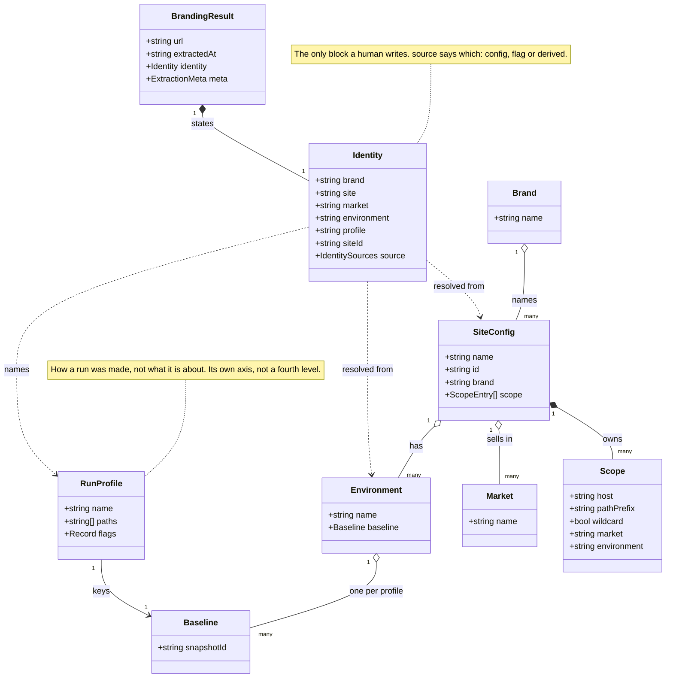
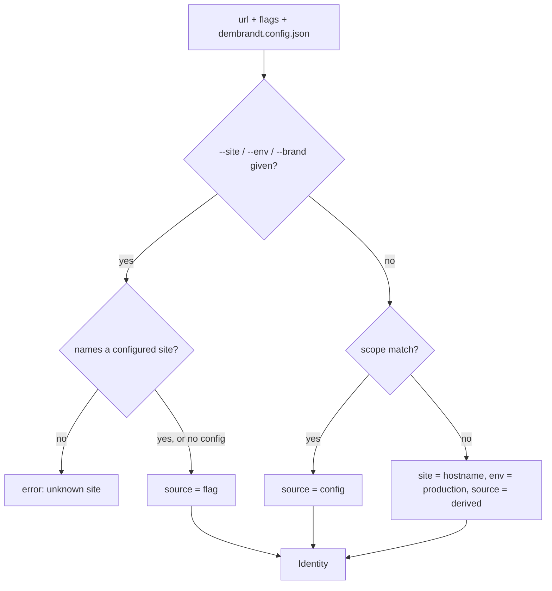
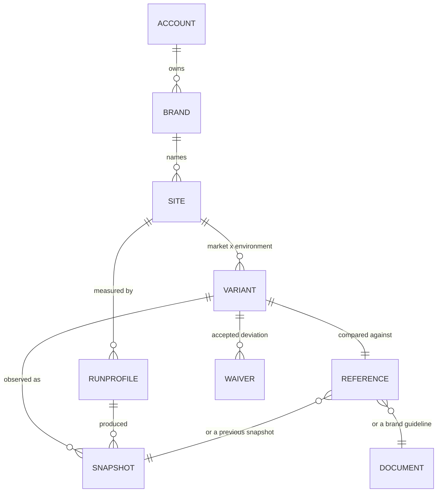

# Extraction identity: brand, site, environment

Status: proposal. Implemented in `lib/identity.ts`; not yet stamped on output.

**Site is the stable baseline identity; a name is presentation.** Storage and
baselines key on `siteId`, which never changes. A name is a label the UI shows
and a human edits, so renaming a site can never move blobs or orphan its drift
history.

Today everything is keyed by hostname. An extraction belongs to a domain, a domain
is a brand, and the portfolio is the list of domains. That one level cannot say
that staging and production are the same brand at two stages, that `docs.` and
`app.` may be one design system or three, or that `dembrandt.com` and
`dembrandt.com/app` are two surfaces of one host.

Identity belongs in the extraction, not in the App. The extraction is what every
consumer reads: CLI, App, MCP server, CI gate, a customer's own pipeline. If the
App invents identity, every other consumer keeps guessing from the hostname, and
two consumers guess differently.

## Type model



Three levels, not four. A section such as `/app` is not a new level: if it has its
own baseline and can drift on its own it is a site, and if it shares one it is a
`scope` entry. Either answer is already expressible, so a fourth level would earn
nothing.

`scope` is a list, not a single host, which is what lets one site span
`app.acme.com` and `acme.com/app`, and what lets `docs.acme.com` be its own site.
A leading `*.` covers every subdomain for the case where one design system spans
all of them; a named subdomain elsewhere still wins over the wildcard.

A scope entry is more than a pattern: it maps a region of URL space to the
variant coordinates that region implies.

```json
{ "name": "marketing", "scope": [
  "acme.com",
  { "pattern": "staging.acme.com", "environment": "staging" },
  { "pattern": "acme.de", "market": "de" },
  { "pattern": "staging.acme.de", "market": "de", "environment": "staging" }
]}
```

Country sites are why market exists as its own coordinate. `acme.de` and
`acme.fr` are one site, because they must be comparable to each other against a
common brand, and they hold separate baselines, because they drift apart on
their own. That is exactly the shape of staging against production, but it is
not the same axis: a country site has a staging of its own, so folding market
into the environment name would smuggle a composite key into a string.

Baselines therefore key on `(siteId, market, environment, profile)`. A site with
one market leaves `market` null and nothing changes for it.

## Scope precedence

For a given url, entries rank by:

1. an exact host beats any wildcard host,
2. among equals, the longer path prefix wins,
3. among those, the site configured first wins, and the tie is reported.

A path prefix matches only on a segment boundary, so a site owning `/app` does
not claim `/application`. A tie between two sites is a configuration error worth
surfacing, not something to break silently.

## Resolution



Precedence is per field. A flag beats config, config beats derivation, and each
field is decided on its own, so a run can take its site and market from config
while a flag sets the environment. `source` records the winner per field for the
same reason: one summary value would have to lie about the fields it did not
describe. Only `brand` can end up `unset`, since nothing derives it.

Flags beat config so an ad hoc run can override a repo's committed identity.
Config beats derivation. Derivation is the floor and reproduces today's hostname
key exactly, so existing data does not become wrong, it becomes labelled.

A `--site` naming no configured site is an error, not a new site. A typo would
otherwise silently start an empty baseline history and report zero drift, and the
mistake would surface weeks later.

`siteId` is stable and opaque; `name` is a mutable label. Storage keys by the id,
because the App's blob layout puts the key in the path
(`extractions/{userId}/{key}/...`) and renaming a site must not move blobs or
break its drift history.

## Profiles: the same site measured two ways

A site is often measured in more than one way. Tone of voice wants the homepage
with `--voice`; design linting wants `--crawl 5`. Both are the same site, so they
are not two sites, but they are not comparable to each other either, so they
cannot share a baseline.

So an extraction has three axes, not one: what it is about (identity), how it was
made (profile), and when (`extractedAt`, keyed by `meta.snapshotId`). A baseline
belongs to `(siteId, environment, profile)`.

```
site   marketing
  env  production
    profile  design   --crawl 5      -> baseline, drift score
    profile  voice    / --voice      -> its own baseline, its own timeline
```

A portfolio row stays `(site, env)` and carries N profiles. Their scores are not
averaged into one number: design drift and a voice change are different claims,
and a combined figure would be an artefact of which profiles happened to run.

The profile is named in config rather than fingerprinted from the flags. A hash
needs no human but puts "baseline a3f9" in the portfolio, and nobody can tell
which run that was. The declared flags are then the check: a run whose flags do
not match its profile is warned about, the same false-drift problem `drift.ts`
already reports for `--dark-mode` and `--mobile` mismatches.

A profile also carries its target paths, since that is what separates the two
runs above as much as the flags do. Those paths must fall inside the site's
scope: both list paths, so both can disagree, and a profile pointing outside its
site would file a measurement of one site under another.

## Placement in the output

`identity` is a top-level block beside `url`, not part of `meta`. `meta` holds the
run's conditions: versions, viewport, flags, degraded. All of it measured or set
by the environment. Identity is a stated fact and has to be marked as one, which
is also what DEM-320 asks for.

A crawl stays one extraction with one identity. Multi-page runs already merge into
one result with `pages[]`, and `scope` is where the paths belonging to a site are
declared.

## Terminology: portfolio is a view, not a level

Brand, site, environment and profile form the measurement axis, and each passes
the same test: it has its own baseline and can drift on its own.

A portfolio is the collection of brands an account manages. It fails that test,
because it is not a subject of measurement at all. It belongs to a second axis,
ownership, which runs account > (client) > brand and answers who may see a thing
and who pays for it. With one portfolio per account it needs no entity: the
account already exists as the root of the blob layout, and the portfolio is how
the App renders it. Several named portfolios under one account would be a saved
filter, not a new level.

For an agency whose client owns several brands, the entity worth having is the
client, not the portfolio. It is still on the ownership axis.

This answers the third decision directly. Grouping by brand and grouping by
ownership are not alternatives: they are two axes, so the portfolio groups by
ownership and shows brands within it, and a flat list stays a third view of the
same data.

Ownership therefore stays out of the extraction. Identity is in the output
because every consumer needs it to group; ownership is needed by none of them and
lives account-side. The concrete reason is that `dembrandt.config.json` is
committed to the customer's own repo and its contents reach their CI logs and
every saved extraction. An agency's client name does not belong there. The
extraction says what it is about; the account says who may see it.

As types: `Brand`, `SiteConfig`, `Environment`, `RunProfile`. Portfolio is a
product word for a list the App renders, not a type.

## Storage model

The same model has three representations, and the rules between them are the
design work.

**Declared**, in the customer's repo: `dembrandt.config.json` holds `Brand`,
`Site`, `ScopeEntry` and `RunProfile`. Editable, portable, written by a human or
an agent. No history, and no identifier the customer cannot read.

**Stated**, in the extraction: `Identity`, flat and denormalized. A snapshot has
to be readable on its own years later without our account data, so it carries
names rather than references, and it is immutable because it describes a moment.

**Accumulated**, account-side: the entities and their history. This is the part
being sold, and the only one that normalizes, because names change and history
must not break.

An extraction denormalizes for readability, the store normalizes for
persistence, and the config is the source for the declared side. A disagreement
resolves in favour of the store, which is the only one holding history.

```
Account        accountId
Brand          brandId
Site           siteId                                  stable, opaque
Variant        (siteId, market, environment)           the measurable coordinate
RunProfile     (siteId, profileName)                   the way of measuring
Snapshot       snapshotId                              an immutable event
Reference      (siteId, market, environment, profile)  what a run is compared against
Waiver         (same key, findingId)                   an accepted deviation
```

`Variant` is worth naming even though it is only a pair. Unnamed, every surface
composes `market + environment` itself, which is the scattered derivation we
removed from the hostname, one level up.

`Reference` has two forms: a previous snapshot, or a document, meaning a brand
guideline. Same key, same role, different source. Left unnamed, the first
implementation pins the reference to the previous snapshot and the product's
document-first direction has to unpick that later. The distinction is also the
difference between answering "did it change" and answering "is it right", and
only the second is what a brand owner is buying.

`Waiver` is the other missing entity. A campaign site deviates on purpose, and a
market may carry an approved difference. Without a way to accept a deviation,
drift is noise from the second run onward and the third is not read.



### Layout

Today's path is `extractions/{userId}/{domain}/{timestamp}.json`, which puts the
key in the path. Pushing the coordinates deeper into that tree repeats the same
mistake one level up, because `market` and `environment` are editable labels just
as a name is. The principle decides it: a path holds stable identifiers only.

```
extractions/{accountId}/{siteId}/{timestamp}--{snapshotId}.json
extractions/{accountId}/{siteId}/_index.json     coordinates -> snapshots
```

Coordinates live in the index, not in the directory structure. The index already
exists, and is already built to be a rebuildable cache that is ignored when its
version does not match, so this extends a mechanism rather than adding one.

## Open decisions

- Reference and waiver are named here but not modelled in `lib/identity.ts`.
  They belong to the account-side store, not the extraction, so they follow the
  App rather than the CLI contract.
- Billing. Credits are keyed by domain today. Once a site is user-declared, the
  customer controls the grouping, so the billed unit has to be decided before
  identity ships rather than restricted afterwards.
- Whether `client` becomes a real entity on the ownership axis, or an account
  stays the only boundary. Needed once one account manages brands it does not own.
- Whether `market` should also cover language editions on one host, e.g.
  `acme.com/de`. The path form already expresses it; what is undecided is
  whether that is the same concept.
